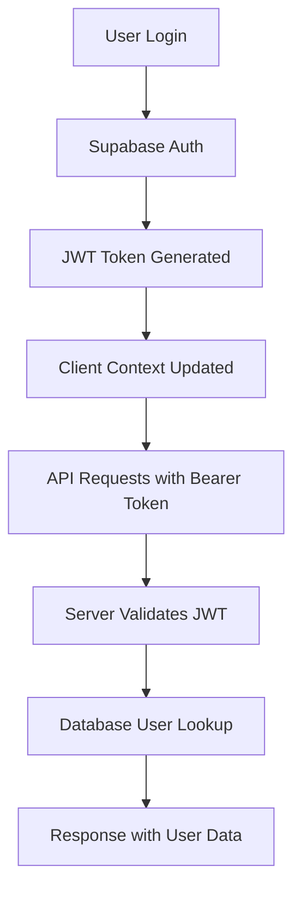

# FindMyPic - Authentication Architecture

## 🔐 Overview

**Status**: ✅ FUNZIONANTE
**Auth Provider**: Supabase Auth
**Database**: PostgreSQL (Supabase)
**Frontend**: Next.js 15 with React Context

## 🏗️ Authentication Flow



## 📁 File Structure

```
src/
├── lib/auth/
│   ├── client.tsx          # Client-side auth context
│   └── server.ts           # Server-side auth validation
├── hooks/
│   └── useApiRequest.ts    # Authenticated API requests
├── middleware.ts           # Route protection
└── app/api/*/route.ts      # API endpoints with auth
```

## 🔧 Client-Side Authentication

### Auth Context (`src/lib/auth/client.tsx`)

**Key Features**:
- React Context for global auth state
- Supabase client integration
- Automatic token refresh
- Profile caching for performance

**Core Implementation**:
```typescript
export function AuthProvider({ children }: { children: React.ReactNode }) {
  const [user, setUser] = useState<User | null>(null)
  const [userProfile, setUserProfile] = useState<UserProfile | null>(null)
  const [loading, setLoading] = useState(true)
  const [initialCheckDone, setInitialCheckDone] = useState(false)

  // Listens for auth state changes
  supabase.auth.onAuthStateChange(async (event, session) => {
    setUser(session?.user ?? null)
    if (session?.user) {
      fetchUserProfile(session.user)
    }
  })
}
```

**User Profile Structure**:
```typescript
type UserProfile = {
  id: string
  email: string
  isAdmin: boolean
  role: string
  permissions: any
  plan: string
  searches: number
  createdAt: string
  profile: any
}
```

### Authenticated API Requests (`src/hooks/useApiRequest.ts`)

**Purpose**: Ensures all API calls include proper authentication headers

**Implementation**:
```typescript
export function useApiRequest() {
  return useCallback(async (url: string, options: RequestInit = {}) => {
    // Get session from Supabase
    const { data: { session } } = await supabase.auth.getSession()
    
    // Add Authorization header
    const headers = {
      'Content-Type': 'application/json',
      ...options.headers
    }
    
    if (session?.access_token) {
      headers['Authorization'] = `Bearer ${session.access_token}`
    }
    
    return fetch(url, {
      ...options,
      credentials: 'include',
      headers
    })
  }, [user])
}
```

## 🛡️ Server-Side Authentication

### Auth Validation (`src/lib/auth/server.ts`)

**Key Functions**:

**1. getCurrentUser(request)**
```typescript
export async function getCurrentUser(request: NextRequest): Promise<AuthenticatedUser | null> {
  try {
    // Extract Bearer token from Authorization header
    const authHeader = request.headers.get('authorization')
    if (!authHeader?.startsWith('Bearer ')) {
      return null
    }
    
    const token = authHeader.replace('Bearer ', '')
    
    // Validate JWT with Supabase
    const { data: { user }, error } = await adminClient.auth.getUser(token)
    if (error || !user) return null
    
    // Lookup user in database
    const userData = await prisma.user.findUnique({
      where: { id: user.id },
      include: { profile: true }
    })
    
    if (!userData) return null
    
    // Merge Supabase metadata with database data
    const isAdminFromSupabase = 
      user.user_metadata?.isAdmin === true || 
      user.user_metadata?.role === 'admin' ||
      user.app_metadata?.role === 'admin'
    
    return {
      id: userData.id,
      email: userData.email,
      isAdmin: isAdminFromSupabase || userData.isAdmin,
      role: user.user_metadata?.role || userData.role,
      permissions: userData.permissions,
      plan: userData.plan,
      searches: userData.searches,
      createdAt: userData.createdAt.toISOString(),
      profile: userData.profile
    }
  } catch (error) {
    console.error('[AUTH] getCurrentUser error:', error)
    return null
  }
}
```

**2. requireAuth(request)**
```typescript
export async function requireAuth(request: NextRequest): Promise<AuthenticatedUser> {
  const user = await getCurrentUser(request)
  if (!user) {
    throw new Error('Authentication required')
  }
  return user
}
```

**3. requireAdmin(request)**
```typescript
export async function requireAdmin(request: NextRequest): Promise<AuthenticatedUser> {
  const user = await requireAuth(request)
  if (!user.isAdmin) {
    throw new Error('Admin access required')
  }
  return user
}
```

## 🚦 Route Protection

### Middleware (`src/middleware.ts`)

**Protected Routes**:
- `/dashboard/*` - Requires authentication
- `/admin/*` - Requires admin role
- `/api/user/*` - Requires authentication
- `/api/admin/*` - Requires admin role

**Implementation**:
```typescript
export async function middleware(request: NextRequest) {
  const path = request.nextUrl.pathname
  
  // Check if route requires protection
  const isProtectedRoute = path.startsWith('/dashboard') || 
                          path.startsWith('/admin') ||
                          path.startsWith('/api/user') ||
                          path.startsWith('/api/admin')
  
  if (isProtectedRoute) {
    const user = await getCurrentUser(request)
    
    if (!user) {
      // Redirect to login or return 401
      return NextResponse.redirect(new URL('/login', request.url))
    }
    
    // Admin route check
    if (path.startsWith('/admin') && !user.isAdmin) {
      return NextResponse.redirect(new URL('/dashboard', request.url))
    }
  }
  
  return NextResponse.next()
}
```

## 🔑 API Route Authentication Pattern

### Standard API Route Structure

```typescript
// src/app/api/user/profile/route.ts
export async function GET(request: NextRequest) {
  try {
    // Validate authentication
    const user = await getCurrentUser(request)
    if (!user) {
      return NextResponse.json(
        { error: 'Accesso non autorizzato' }, 
        { status: 401 }
      )
    }
    
    // Process authenticated request
    return NextResponse.json(user)
    
  } catch (error) {
    console.error('API Error:', error)
    return NextResponse.json(
      { error: 'Errore interno del server' }, 
      { status: 500 }
    )
  }
}
```

### Admin API Route Structure

```typescript
// src/app/api/admin/users/route.ts
export async function GET(request: NextRequest) {
  try {
    // Require admin access
    const user = await requireAdmin(request)
    
    // Admin-only logic
    const users = await prisma.user.findMany()
    return NextResponse.json(users)
    
  } catch (error) {
    if (error.message.includes('Admin access required')) {
      return NextResponse.json({ error: 'Accesso negato' }, { status: 403 })
    }
    return NextResponse.json({ error: 'Errore del server' }, { status: 500 })
  }
}
```

## 👤 User Registration & Login

### Registration Flow

1. **Frontend**: User submits email/password
2. **Supabase**: Creates auth account
3. **Database**: Trigger creates user record
4. **Email**: Confirmation sent (if enabled)

### Login Flow

1. **Frontend**: User submits credentials
2. **Supabase**: Validates and returns JWT
3. **Client Context**: Updates user state
4. **Database**: User profile fetched
5. **Redirect**: User sent to dashboard

### Admin Role Management

**Admin users are determined by**:
1. `user_metadata.isAdmin = true` in Supabase
2. `user_metadata.role = 'admin'` in Supabase  
3. `app_metadata.role = 'admin'` in Supabase
4. `isAdmin = true` in database User table

**Priority**: Supabase metadata overrides database value

## 🔍 Debugging Authentication

### Client-Side Debug

```typescript
// In browser console
import { debugAuthState } from '@/utils/debugAuth'
debugAuthState()
```

### Server-Side Debug

```bash
# Check database connection
curl https://www.findmypic.app/api/debug-supabase-connection

# Test auth endpoint (should return 401)
curl https://www.findmypic.app/api/user/profile

# Test with token
curl -H "Authorization: Bearer YOUR_TOKEN" https://www.findmypic.app/api/user/profile
```

### Log Patterns

```typescript
console.log('[AUTH] Session for profile fetch:', {
  hasSession: !!session,
  hasUser: !!session?.user,
  hasAccessToken: !!session?.access_token,
  userEmail: session?.user?.email
})
```

## ⚠️ Security Considerations

### JWT Validation
- ✅ All API routes validate JWT tokens
- ✅ Tokens expire automatically
- ✅ Server-side validation with Supabase admin client

### Route Protection
- ✅ Middleware blocks unauthorized access
- ✅ API routes have individual auth checks
- ✅ Admin routes require explicit admin verification

### Data Privacy
- ✅ User passwords handled by Supabase (not stored locally)
- ✅ JWT tokens contain minimal user data
- ✅ Sensitive operations require re-authentication

### Best Practices Applied
- ✅ Server-side user lookup for authoritative data
- ✅ Role-based access control (RBAC)
- ✅ Proper error handling without information leakage
- ✅ Token-based authentication (stateless)

---

**🔒 This authentication system is production-ready and tested. Modify with extreme caution.**